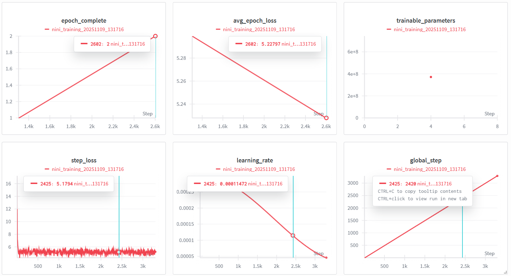

# Transformers from Scratch

## File illustration
`modeling_nini.py` contains the whole implenmentation and design of the Transformers decoder model: nini.  
`inference.py` facilitates to utilize nini model to predict the next token, which is poor in performance due to limited training, data and model scale.  
`infer_nini.py` helps to valid the correctness of the transformers model, to see the logits, output content and etc.  
`train.py` consists of the main logics of training the model.  

`Loss curve` can be found in `Training_Dynamics.png`.

 

